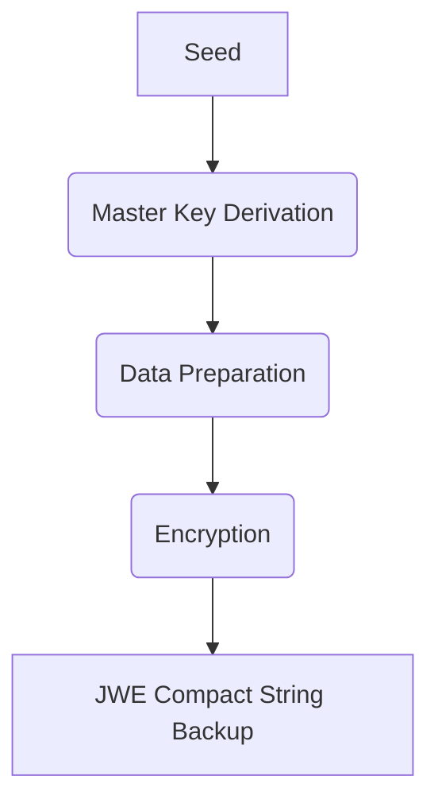

# Package org.hyperledger.identus.walletsdk.pluto.backup

## Secure Wallet Backups

Secure wallet backups through robust encryption using a master key derived from a seed, adhering to
the BIP32 standard. The backup data, structured as a JSON document, includes keys, DIDs,
credentials, and messages, with semantic versioning for future compatibility. During recovery, a
data purging strategy ensures data integrity by overwriting existing data with the backup.

### The Foundation: Encryption and Key Management

At the heart of the backup solution lies robust encryption. The process begins with the derivation
of a master key from a seed, following the BIP32 standard. This master key is then used to encrypt
the wallet data using JSON Web Encryption (JWE), a widely adopted standard. The encryption
algorithm, ECDH-ES+A256KW, combined with AES-256-CBC and HMAC SHA-512, ensures that the data remains
confidential and tamper-proof.

### Data Specifications: Structure and Versioning

The structure of the backup data, which is formatted as a JSON document. This structure includes
essential elements like keys, decentralized identifiers (DIDs), credentials, and messages. To
accommodate future changes, the specification adheres to semantic versioning (semver), allowing for
updates and modifications while maintaining backward compatibility.

#### V0.0.1 JSON Schema

```json
{
  "$schema": "http://json-schema.org/prism-wallet/backup/v1.0",
  "type": "object",
  "properties": {
    "link_secret": {
      "type": "string"
    },
    "keys": {
      "type": "array",
      "items": {
        "type": "object",
        "properties": {
          "recovery_id": {
            "type": "string"
          },
          "key": {
            "type": "string"
          },
          "did": {
            "type": "string"
          },
          "index": {
            "type": "number"
          }
        },
        "required": [
          "key"
        ],
        "additionalProperties": false
      }
    },
    "dids": {
      "type": "array",
      "items": {
        "type": "object",
        "properties": {
          "did": {
            "type": "string"
          },
          "alias": {
            "type": "string"
          }
        }
      },
      "mediators": {
        "type": "array",
        "items": {
          "type": "object",
          "properties": {
            "mediator_did": {
              "type": "string"
            },
            "holder_did": {
              "type": "string"
            },
            "routing_did": {
              "type": "string"
            }
          },
          "required": [
            "mediator_did",
            "holder_did",
            "routing_did"
          ],
          "additionalProperties": false
        }
      },
      "did_pairs": {
        "type": "array",
        "items": {
          "type": "object",
          "properties": {
            "holder": {
              "type": "string"
            },
            "recipient": {
              "type": "string"
            },
            "alias": {
              "type": "string"
            }
          },
          "required": [
            "holder",
            "recipient"
          ],
          "additionalProperties": false
        }
      },
      "credentials": {
        "type": "array",
        "items": {
          "type": "object",
          "properties": {
            "data": {
              "type": "string"
            },
            "recovery_id": {
              "type": "string"
            }
          },
          "required": [
            "data",
            "recoveryId"
          ],
          "additionalProperties": false
        }
      },
      "messages": {
        "type": "array",
        "items": {
          "type": "string",
          "additionalProperties": false
        }
      }
    },
    "additionalProperties": false
  }
}
```

### Data Recovery: Purging and Importing

In the process of recovering wallet data from a backup, it is paramount to address the potential
issue of data duplication to ensure the integrity and consistency of the restored wallet. To
mitigate any potential conflicts and maintain the accuracy of wallet data, a deliberate data purging
strategy is adopted.


